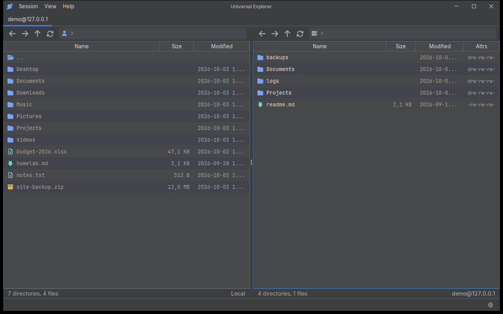
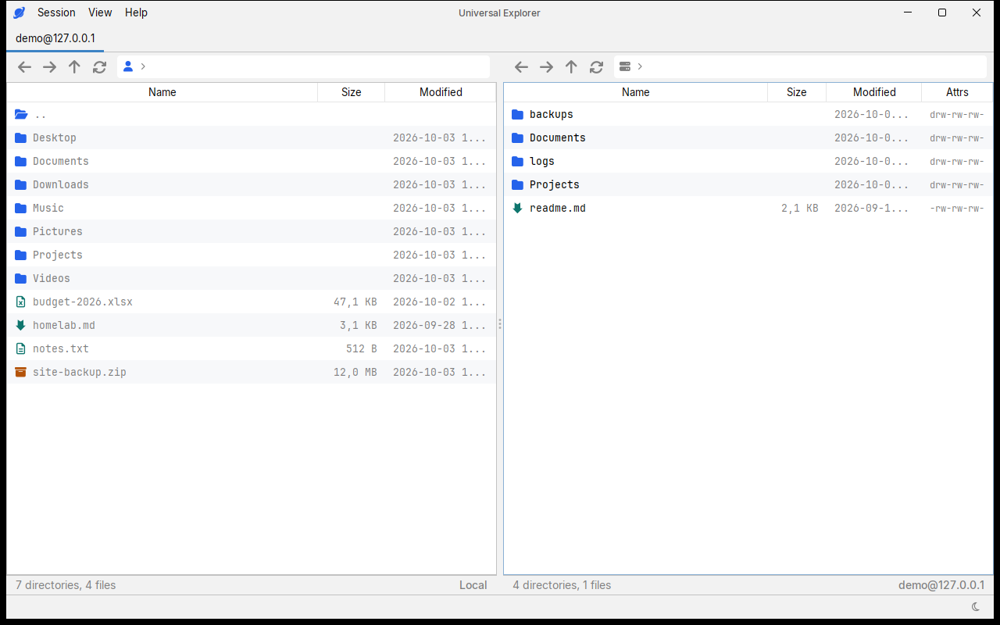
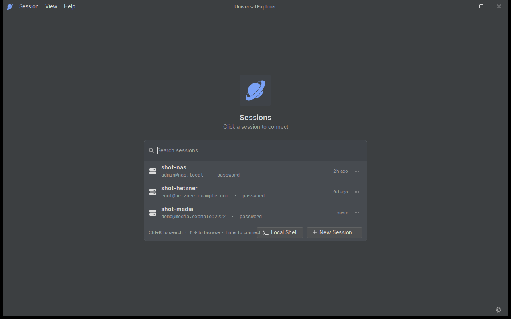
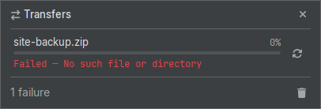
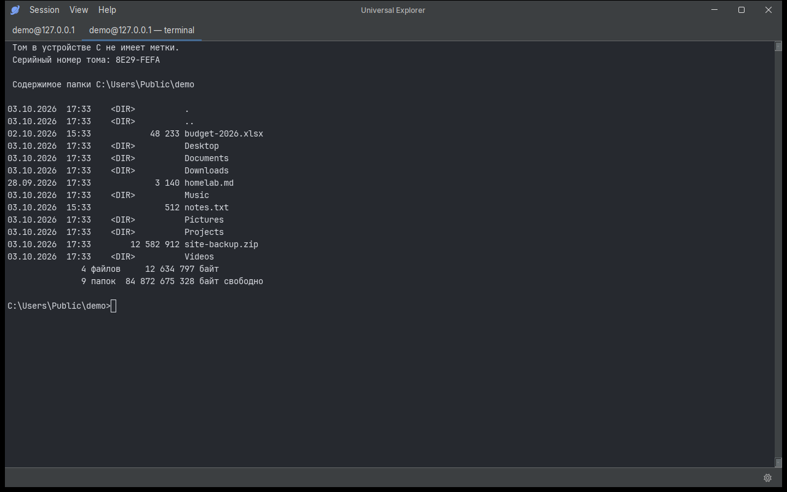
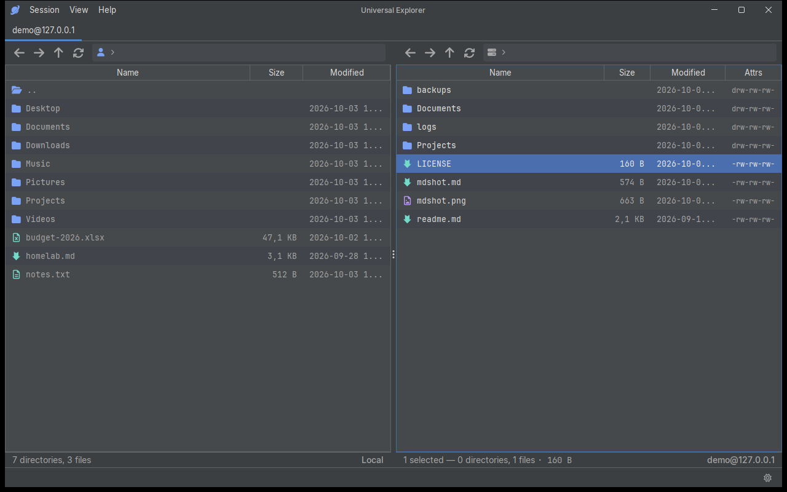

<div align="center">

# Universal Explorer


A fast, keyboard-first multi-protocol file client for Windows.

SFTP · SMB · WebDAV · FTP · S3 — one dual-pane shell with a built-in
terminal, viewer, and editor.

[Features](#features) · [Screenshots](#screenshots) · [Build and run](#build-and-run) · [How this project is made](#how-this-project-is-made) · [License](#license)

</div>

## Why this exists

My file client for many years was WinSCP — a good free tool this
project owes a lot to. But it is Windows-only, its interface is — to
put it mildly — dated and fragile, and it never spoke SMB, which is
what half of the machines I deal with live on. What I wanted was a
single tool for all of it: every protocol I actually use, on whatever
machine I happen to sit at. I looked for one, didn't find it, and
started building it instead.

Windows comes first today; the core is plain JVM on purpose, and
spreading to other desktops is part of the point.

## Features

- **Dual-pane Commander**, switchable at runtime to a single-pane Explorer layout — the same session, two ways of working.
- **Five protocols in one shell**: SFTP (with SSH agent and key support), SMB shares, WebDAV, FTP, and S3-compatible object storage (AWS, MinIO, R2, Wasabi…) with buckets as the virtual root. New protocols drop in as modules behind an SPI — the shell never links them directly.
- **Session tabs** with per-site memory: every session reopens exactly where its panes last stood, local and remote.
- **Background transfer queue** — copies and moves keep running while you browse.
- **Built-in surfaces**: an embedded terminal (JediTerm), an image viewer, a text editor with syntax highlighting, a markdown reader, streaming media playback, and archive browsing.
- **Dark and light themes** that follow Windows, FlatLaf-based, with bundled Inter, JetBrains Mono, and Nerd Font glyphs.
- **Secrets stay secrets**: passwords and key passphrases live in the Windows Credential Manager, never in files. Sessions and remembered paths are plain JSON under `%APPDATA%\Universal Explorer`.
- **Keyboard-first throughout** — `F5`/`F6` copy/move, arrow-key hopping between panes, type-to-select everywhere.

## Screenshots

| Commander (dark) | Commander (light) |
|---|---|
|  |  |

| Home · saved sessions (dark) | Transfers (dark) |
|---|---|
|  |  |

| Terminal (dark) | Markdown reader (dark) |
|---|---|
|  |  |

## Build and run

Universal Explorer is Windows-first and needs a **JDK 25**.

```
gradlew.bat :app:run
```

That's it. The first run downloads the pinned official LibVLC runtime
(~80 MB, checksum-verified) so media playback works out of the box.

```
gradlew.bat test          # full test suite
gradlew.bat :app:icon     # render the app icon
```

The screenshot harness — which is also the deterministic UI verifier —
runs via `gradlew.bat :app:run --args="--screenshot"`.

## Where your data lives

- Sessions and remembered paths: `%APPDATA%\Universal Explorer\sessions.json`
- Passwords and key passphrases: Windows Credential Manager, under
  `Universal Explorer/<site>` — plaintext secrets are never written to disk.
- Nothing phones home. There is no telemetry, no update checker, no
  account.

## How this project is made

Full disclosure, because it is the honest thing to do: I am a software
engineer, and I designed this app, made every architectural decision,
and reviewed every change — but I did not type the code myself. It was
written by an AI assistant working under my direction, one small
reviewed slice at a time, each slice gated by tests before it landed.

Universal Explorer is a personal tool, built for my own needs and
shared in case it is useful to anyone else. There is no company, no
product, no roadmap and no obligation behind it. If it serves you —
use it, fork it, have fun with it.

## Third-party components

The app stands on open work: FlatLaf, Apache MINA SSHD, smbj, Sardine,
JediTerm, RSyntaxTextArea, vlcj and friends, plus the Inter, JetBrains
Mono, and Nerd Font typefaces. The full inventory with licenses lives
in [THIRD-PARTY-NOTICES.md](THIRD-PARTY-NOTICES.md). Media playback
loads the official LibVLC runtime at build time; its license texts are
kept beside the binaries.

See also [CONTRIBUTING.md](CONTRIBUTING.md) and
[SECURITY.md](SECURITY.md).

## License

Copyright (c) 2026 Universal Explorer contributors.

Licensed under the [GNU GPL v3](LICENSE) (or, at your option, any
later version). One reason it has to be GPL: media playback rides on
[vlcj](https://github.com/caprica/vlcj), which is GPL v3 itself.
